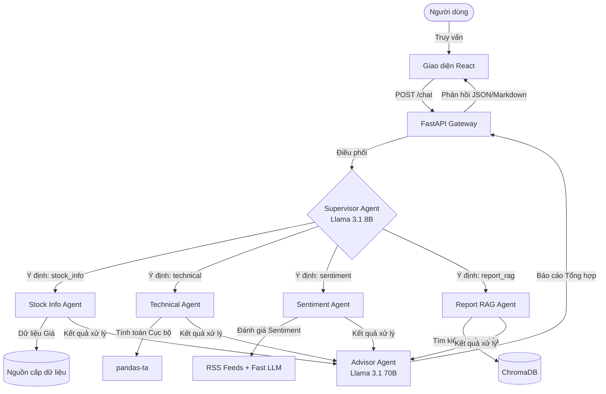

# FinBot: Hệ Thống Đa Tác Nhân Tư Vấn Đầu Tư Chứng Khoán

## 1. Tổng Quan Hệ Thống

FinBot là một hệ thống Trí tuệ Nhân tạo (AI) được thiết kế chuyên biệt cho thị trường chứng khoán Việt Nam. Hệ thống ứng dụng kiến trúc đa tác nhân (Multi-Agent) nhằm hỗ trợ giải đáp các truy vấn tài chính từ người dùng, bao gồm nhà đầu tư cá nhân và tổ chức. Mục tiêu của hệ thống là cung cấp thông tin và tư vấn với độ trễ thấp, tối ưu hóa tài nguyên tính toán (token) và đảm bảo độ chính xác của dữ liệu đầu ra.

## 2. Các Chức Năng Cốt Lõi

1. Tra cứu thông tin doanh nghiệp: Cung cấp các thông tin cơ bản như tên doanh nghiệp, nhóm ngành, vốn hóa thị trường và thông tin ban lãnh đạo dựa trên mã định danh chứng khoán (ticker).
2. Truy xuất và thống kê dữ liệu giá: Xử lý dữ liệu giá lịch sử (giá mở cửa, mức cao nhất, mức thấp nhất, giá đóng cửa, và khối lượng giao dịch). Hệ thống hỗ trợ trích xuất dữ liệu theo các khung thời gian tùy biến (ví dụ: 3 tháng gần nhất, hoặc khoảng thời gian từ ngày 01/01/2023 đến 30/06/2023) cũng như các khung nến tiêu chuẩn (1D, 1W, 1M).
3. Phân tích kỹ thuật: Thực hiện tính toán trực tiếp các chỉ báo kỹ thuật (như SMA, RSI, MACD, Bollinger Bands) theo tham số cửa sổ thời gian (window size) do người dùng chỉ định. Việc tính toán được thực hiện độc lập với mô hình ngôn ngữ lớn (LLM) để tối ưu hiệu suất.
4. Đánh giá tâm lý thị trường (Sentiment Analysis): Thu thập dữ liệu tin tức từ các nguồn cấp dữ liệu chuẩn (RSS) và sử dụng LLM chuyên dụng để phân loại sắc thái văn bản (Tích cực, Tiêu cực, Trung lập) đối với từng mã chứng khoán hoặc nhóm ngành.
5. Truy xuất thông tin từ báo cáo tài chính (RAG): Áp dụng phương pháp Retrieval-Augmented Generation để trích xuất và tổng hợp thông tin từ cơ sở dữ liệu véc-tơ chứa các báo cáo tài chính và báo cáo phân tích.
6. Tư vấn đầu tư: Tổng hợp dữ liệu từ các mô-đun trên (giá, phân tích kỹ thuật, tin tức, báo cáo) để đưa ra các khuyến nghị đầu tư phù hợp với hồ sơ rủi ro của người dùng.

## 3. Kiến Trúc Hệ Thống

Hệ thống được xây dựng dựa trên mô hình điều phối Supervisor-Worker sử dụng framework LangGraph. Khối lượng công việc được phân bổ cho các tác nhân chuyên trách thay vì tập trung vào một mô hình ngôn ngữ duy nhất.

### 3.1. Tác Nhân Điều Phối (Supervisor Agent)

Tác nhân điều phối chịu trách nhiệm phân loại ý định (Intent Classification) và định tuyến truy vấn. Quá trình này sử dụng một mô hình ngôn ngữ có kích thước nhỏ (Llama-3.1-8B) để phân tích đầu vào và cấu trúc hóa đầu ra dưới dạng JSON, giúp giảm độ trễ của khâu định tuyến xuống mức tối thiểu.

### 3.2. Xử Lý Song Song (Parallel Dispatch)

Hệ thống triển khai cơ chế thực thi bất đồng bộ (Asyncio). Đối với các truy vấn phức tạp yêu cầu nhiều luồng thông tin (ví dụ: yêu cầu phân tích kỹ thuật kết hợp phân tích tin tức), tác nhân điều phối sẽ kích hoạt đồng thời các tác nhân nhánh tương ứng. Cơ chế này, kết hợp với kiểm soát tốc độ truy vấn (Rate Limiting), giúp tối ưu hóa thời gian phản hồi toàn trình.

### 3.3. Các Tác Nhân Chuyên Trách (Sub-Agents)

* Stock Info Agent: Chịu trách nhiệm truy vấn thông tin cơ bản và dữ liệu chuỗi thời gian của giá thông qua các API ngoại vi.
* Technical Agent: Xử lý các phép toán thống kê và tính toán chỉ báo kỹ thuật trực tiếp trên môi trường cục bộ thông qua thư viện pandas-ta. LLM chỉ tham gia vào bước diễn giải kết quả tính toán. Điều này giúp giảm thiểu đáng kể số lượng token được sử dụng.
* Sentiment Agent: Phụ trách thu thập dữ liệu văn bản từ các RSS feed và triển khai kỹ thuật xử lý lô (Batch Processing) thông qua một LLM để chấm điểm phân tích sắc thái của nhiều tài liệu cùng lúc.
* Report RAG Agent: Triển khai kỹ thuật RAG. Tác nhân này thực hiện truy vấn thông tin cơ bản trước, sau đó tiến hành tìm kiếm ngữ nghĩa trên ChromaDB đối với các tài liệu PDF đã được nhúng (embedding).

### 3.4. Tác Nhân Tổng Hợp (Advisor Agent)

Đóng vai trò là điểm cuối trong luồng xử lý dữ liệu đối với các yêu cầu tư vấn. Tác nhân này tiếp nhận thông tin đã xử lý từ các tác nhân chuyên trách và sử dụng mô hình ngôn ngữ có tham số lớn (Llama-3.1-70B) để tổng hợp thành một báo cáo cấu trúc, đảm bảo tính chặt chẽ và giảm thiểu hiện tượng ảo giác (hallucination).

## 4. Giải Pháp Tối Ưu Hóa Hiệu Suất

Hệ thống được thiết kế dựa trên ba tiêu chí tối ưu hóa cốt lõi:

* Tối ưu thời gian thực thi: Áp dụng cơ chế bất đồng bộ thông qua FastAPI và Asyncio. Hệ thống bộ nhớ đệm (Cache) đa tầng sử dụng Redis được triển khai cho các lệnh gọi API ngoại vi nhằm giảm thời gian phản hồi cho các truy vấn lặp lại.
* Tối ưu tài nguyên: Triển khai kỹ thuật định tuyến mô hình động (Dynamic Model Routing). Các tác vụ phân loại và tra cứu cơ bản được xử lý bởi mô hình nhỏ, trong khi mô hình lớn chỉ được gọi cho các tác vụ tổng hợp phức tạp. Các phép toán học được chuyển giao hoàn toàn cho CPU xử lý cục bộ.
* Cải thiện độ chính xác: Thiết lập các rào cản kiểm soát hiện tượng ảo giác bằng cách buộc các tác nhân phải cung cấp nguồn trích dẫn. Giao tiếp nội bộ giữa các tác nhân được chuẩn hóa theo định dạng dữ liệu có cấu trúc (Pydantic JSON) để đảm bảo tính nhất quán.

## 5. Technology Stack

* Trí tuệ Nhân tạo cốt lõi: LangChain, LangGraph, Llama-3.1 (thông qua NVIDIA NIM)
* Dịch vụ Backend: FastAPI, Uvicorn, Pydantic
* Dịch vụ Frontend: React, Vite, Recharts
* Cơ sở Dữ liệu và Xử lý: Redis, PostgreSQL, ChromaDB, vnstock, pandas-ta
* Triển khai: Docker Compose

## 6. Hướng Dẫn Khởi Chạy Hệ Thống

1. Yêu cầu môi trường:
* Docker và Docker Compose
* Khóa API NVIDIA NIM (được cấu hình trong tệp .env)

2. Các bước triển khai:
Kéo mã nguồn từ kho lưu trữ, thiết lập biến môi trường và khởi chạy các container thông qua Docker Compose. Môi trường phát triển bao gồm các dịch vụ cơ sở dữ liệu và ứng dụng.

